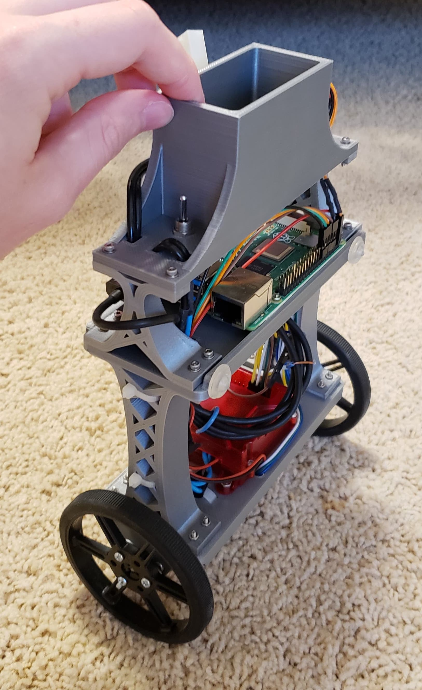

# Self balancing robot
This is(was?) a personal project to learn about control theory and keep me not bored during COVID-19. The robot uses wheel encoders for position estimation and an IMU for tilt. The [IMU](https://learn.adafruit.com/adafruit-bno055-absolute-orientation-sensor) conveniently provides a gravity vector, so I use that to estimate the tilt angle. Below is a picture of the robot. I designed and 3D printed the silver parts.

## Demos
[Here's](https://drive.google.com/file/d/1ticmk_lMk5rpOW2iFd6ypau-YBqnOej_/view?usp=sharing) a video of the robot in operation using model-predictive control. 
[Here's](https://drive.google.com/file/d/1QZD4YKQ5t9Dq5SEYzFLBOTtokt3gvtgQ/view?usp=sharing) a video of it using a linear-quadratic-integral controller.
You can clearly see the MPC controller is able to more aggressively control the position of the mini segway.
Model constants were estimated by weighing the robot manually, and ILQR state feedback constants were found using MATLAB.
The controller takes the output linear acceleration from each model-based method and converts it to wheel velocities by adding it to the current smoothed wheel velocity. 
The motor controller runs a fast PID loop (manufacturer-implemented) to maintain wheel vlocity.

## Controllers
I played with a variety of controllers, beginning with simple PID, then cascading PID, then LQR, then ILQR for position control, then finally MPC for the best tracking performance.
All model-based controllers treat the robot as a simplified inverted pendulum on a cart, and to turn adds an offset velocity to each wheel. 
These velocities are scaled so that the robot uniformly follows an arc specified by the *target* forward and angular velocity, not deviating from this arc even if the robot slows down.

Implementations of PID, ILQR, and MPC are visible in the code, which is built with ROS.

I also made a simple implementation of pure pursuit for waypoint-following, primarily to help me test the driving capabilities. To improve odometry estimates, it fuses the wheel encoder pose update with IMU rotation information. 
